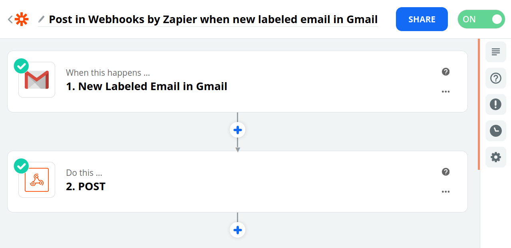
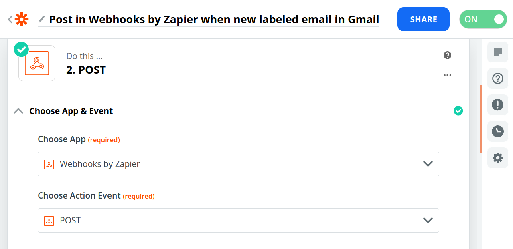
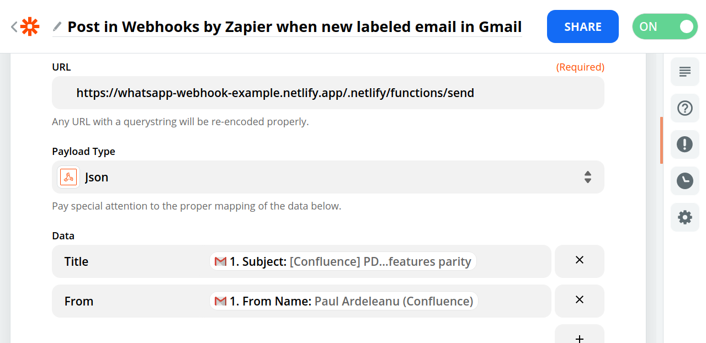

# Integrate Anything with WhatsApp

This repo holds a Netlify function in NodeJS that integrates with [Vonage Messages API](https://developer.nexmo.com/messages/overview) to send WhatsApp messages.

You will need:

* A [Netlify account](https://app.netlify.com/signup)
* A [Vonage account](https://dashboard.nexmo.com/sign-up?utm_source=DEV_REL&utm_medium=github&utm_campaign=ifttt-netlify)
* The details of your WhatsApp Business account - or you can use the [Messages Sandbox](https://dashboard.nexmo.com/messages/sandbox?utm_source=DEV_REL&utm_medium=github&utm_campaign=netlify-whatsapp-sender) to try things out if you don't have one.

## Set up the app

1. Fork this repository to your own account
2. On Netlify, start a new "Site" from a git repository - and point to your new fork
3. Add environment variables (under "Site settings" -> "Build and Deploy" -> "Environment"):

    * `NEXMO_API_KEY` and `NEXMO_API_SECRET` from your Vonage Account Dashboard
    * Create an application on Vonage, with Messages enabled (this app doesn't use the webhooks), use its ID as `NEXMO_APPLICATION_ID`
    * Copy the private key, replace newlines with `\n` and set it as `NEXMO_APPLICATION_PRIVATE_KEY`
    * `API_HOST` should be `messages-sandbox.nexmo.com` if you are using the Messages Sandbox
    * The sandbox WhatsApp number `WHATSAPP_NUMBER` is usually `14157386170`
    * Finally the number that should receive the notifications should be in env var `TO_NUMBER`. Make sure that this number is whitelisted in the Messages Sandbox.

Now redeploy the site to pick up the new environment variables!

Link your code to .... something! My favourite example: [Zapier](https://zapier.com)!

## Configure Zapier to use your function

I'm using an example with email as the trigger, but you could use _anything_ as the input. The data fields in the webhook setup do work - either use the Title and From fields from my example, or customise the code to suit your needs!

An example configuration with Zapier:

For the Webhook, first set the Action type and verb (POST):

Finally use the URL of **your** Netlify function in the last step of configuration. Look at your function in the netlify interface to find the URL of the function.

Zapier offers you the opportunity to test the setup, so do that and make sure things look good.

## Getting Help

We love to hear from you so if you have questions, comments or find a bug in the project, let us know! You can either:

* Open an issue on this repository
* Tweet at us! We're [@VonageDev on Twitter](https://twitter.com/VonageDev)
* Or [join the Vonage Community Slack](https://developer.nexmo.com/community/slack)

## Further Reading

* Check out the Developer Documentation at <https://developer.nexmo.com>

